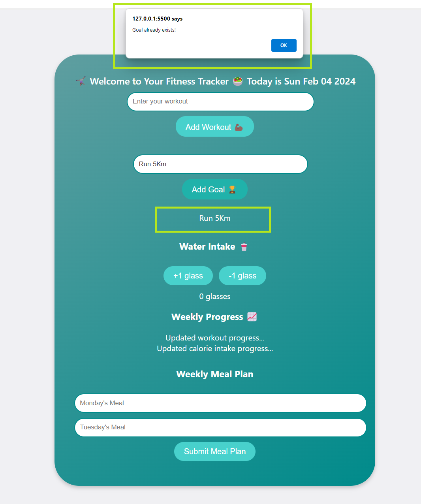

# Debugging Duplicate Goals

**Brief:**

In the updated code, users cannot add the same fitness goal multiple times to avoid duplicate entries in the goal list to enhance the user experience. I implemented a check to ensure that the same goal cannot be added more than once. If a duplicate goal is detected, an alert is displayed to inform the user that the goal already exists and it is NOT added to the list. If NO duplicates are detected, the user can proceed to create and add the new goal as before.

**Coding Choices:** 
- I used `querySelectorAll` to retrieve all the existing goals in the `goalList` as it is convenient and doesn't require me to loop through all elements in the document to see if it matches a certain criteria.

- I used the `if` conditional statement to control how the code is executed. The first block of code checks if the text content of the goal matches any of the goals inputd, and the second condition checks if there's a duplicate and alerts the user that there is a duplicate.

- Exited the function using `return` to prevent the duplicate goal from being added

Practice challenges on Scrimba: https://scrimba.com/playlist/pwVxGLDUW